# Email CLICK Event CDP Integration Flow

## Overview

This document illustrates the complete flow of Email CLICK events through the E360 Messaging CDP (Customer Data Platform) integration system. The flow shows how email link clicks are detected, processed, transformed, and ingested into Salesforce's CDP for comprehensive customer journey analytics.

## Flow Diagram

```mermaid
flowchart TD
    %% Email System Components
    A[Email Client/Service] --> B[Email Sent]
    B --> C[Recipient Opens Email]
    C --> D[Recipient Clicks Link]
    
    %% Link Tracking System
    D --> E[Click Tracking Pixel/URL]
    E --> F[Link Resolution Service]
    F --> G[Original URL: tracking.salesforce.com/click/abc123]
    F --> H[Resolved URL: salesforce.com/products/feature?utm_source=email]
    
    %% Event Creation
    E --> I[Click Event Detected]
    I --> J[E360MessageEvent Creation]
    
    %% Event Data Population
    J --> K[Set ChannelID: EMAIL]
    J --> L[Set EventType: CLICK]
    J --> M[Set Link Data]
    J --> N[Set User Context]
    J --> O[Set Email Context]
    
    %% Link Data Details
    M --> M1[linkName: 'Learn More']
    M --> M2[linkURL: tracking URL]
    M --> M3[resolvedURL: final destination]
    M --> M4[componentId: content block]
    
    %% User Context Details
    N --> N1[recipientIP: 203.0.113.42]
    N --> N2[userAgent: browser info]
    
    %% Email Context Details
    O --> O1[fromAddress: sender@email.com]
    O --> O2[subject: email subject]
    O --> O3[contactPointEmailAddress: recipient@email.com]
    O --> O4[messageID: unique message ID]
    
    %% Event Processing
    J --> P[E360MessageEvent Object]
    P --> Q[CdpEventMapper]
    
    %% Data Transformation
    Q --> R[Convert to CDP Format]
    R --> S[Map Fields to CDP Schema]
    S --> T[Create Protobuf Struct]
    
    %% Field Mapping Process
    S --> S1[Map linkName → LinkName]
    S --> S2[Map linkURL → LinkUrl]
    S --> S3[Map resolvedURL → ResolvedUrl]
    S --> S4[Map recipientIP → RecipientIp]
    S --> S5[Map userAgent → UserAgent]
    S --> S6[Map fromAddress → From]
    S --> S7[Map subject → Subject]
    S --> S8[Map contactPointEmailAddress → ContactPointEmailAddress]
    
    %% Context Merging
    S --> S9[Merge Context Data]
    S9 --> S10[context: general context]
    S9 --> S11[recipientContext: recipient-specific]
    S9 --> S12[additionalContext: processing context]
    
    %% CDP Ingestion
    T --> U[IngestEventToCdpService]
    U --> V[Group Events by Tenant/Channel]
    V --> W[Create GroupKey]
    
    %% Grouping Logic
    W --> W1[tenant: salesforce_tenant]
    W --> W2[coreTenant: core_tenant_123]
    W --> W3[orgType: EASY/STANDARD]
    W --> W4[channel: EMAIL]
    
    %% gRPC Request Creation
    U --> X[Build gRPC Request]
    X --> Y[DataIngestionApiRequest]
    
    %% Request Structure
    Y --> Y1[dataConnectorName: MessagingEventEmail]
    Y --> Y2[eventTypeName: EmailEngagementEvents]
    Y --> Y3[data: Array of Struct objects]
    
    %% CDP Communication
    Y --> Z[gRPC Client]
    Z --> AA[CDP Beacon Service]
    AA --> BB[CDP Data Platform]
    
    %% Response Handling
    BB --> CC[CDP Processing]
    CC --> DD[Data Validation]
    DD --> EE[Schema Validation]
    EE --> FF[Data Storage]
    FF --> GG[Success Response]
    GG --> HH[Empty Response]
    HH --> II[CompletableFuture Complete]
    
    %% Error Handling
    DD --> JJ[Validation Error]
    EE --> KK[Schema Error]
    FF --> LL[Storage Error]
    JJ --> MM[Error Response]
    KK --> MM
    LL --> MM
    MM --> NN[Exception Handling]
    NN --> OO[Retry Logic]
    OO --> Z
    
    %% Configuration
    PP[CdpIngestionConfig] --> U
    QQ[Field Mapping Config] --> S
    RR[CDP Schema Config] --> S
    
    %% Styling with Better Colors
    classDef emailSystem fill:#d4edda,stroke:#155724,stroke-width:2px,color:#155724
    classDef eventCreation fill:#d1ecf1,stroke:#0c5460,stroke-width:2px,color:#0c5460
    classDef dataTransformation fill:#fff3cd,stroke:#856404,stroke-width:2px,color:#856404
    classDef cdpIngestion fill:#f8d7da,stroke:#721c24,stroke-width:2px,color:#721c24
    classDef errorHandling fill:#f5c6cb,stroke:#721c24,stroke-width:2px,color:#721c24
    classDef linkData fill:#e2e3e5,stroke:#383d41,stroke-width:2px,color:#383d41
    classDef userContext fill:#d6d8db,stroke:#1b1e21,stroke-width:2px,color:#1b1e21
    classDef emailContext fill:#cce5ff,stroke:#004085,stroke-width:2px,color:#004085
    classDef fieldMapping fill:#d4f1f4,stroke:#0c5460,stroke-width:2px,color:#0c5460
    classDef contextMerging fill:#e7f3ff,stroke:#004085,stroke-width:2px,color:#004085
    classDef groupingLogic fill:#f8f9fa,stroke:#6c757d,stroke-width:2px,color:#6c757d
    classDef requestStructure fill:#e2f0fb,stroke:#0c5460,stroke-width:2px,color:#0c5460
    classDef responseHandling fill:#d1f2eb,stroke:#0f5132,stroke-width:2px,color:#0f5132
    classDef configuration fill:#fdf2e9,stroke:#92400e,stroke-width:2px,color:#92400e
    
    class A,B,C,D emailSystem
    class I,J,K,L,N,O,P eventCreation
    class Q,R,T dataTransformation
    class U,V,X,Z,AA,BB cdpIngestion
    class JJ,KK,LL,MM,NN,OO errorHandling
    class M,M1,M2,M3,M4 linkData
    class N1,N2 userContext
    class O1,O2,O3,O4 emailContext
    class S,S1,S2,S3,S4,S5,S6,S7,S8 fieldMapping
    class S9,S10,S11,S12 contextMerging
    class W,W1,W2,W3,W4 groupingLogic
    class Y,Y1,Y2,Y3 requestStructure
    class CC,DD,EE,FF,GG,HH,II responseHandling
    class PP,QQ,RR configuration
```



## Color Legend

| Color | Phase | Description |
|-------|-------|-------------|
| 🟢 **Green** | Email System | Email sending and recipient interaction |
| 🔵 **Cyan** | Event Creation | Click detection and event object creation |
| 🟡 **Yellow** | Data Transformation | Data mapping and transformation processes |
| 🔴 **Red** | CDP Ingestion | CDP service communication and ingestion |
| 🟢 **Teal** | Response Handling | CDP processing and response handling |
| 🩷 **Pink** | Error Handling | Error scenarios and exception handling |

## Detailed Flow Description

### Phase 1: Email Click Detection 🟢
1. **Email Sent** → Email service sends email with tracking links
2. **Recipient Interaction** → Recipient opens email and clicks a link
3. **Click Tracking** → System detects click on tracking URL
4. **Link Resolution** → Original tracking URL resolves to final destination

### Phase 2: Event Creation 🔵
1. **Event Detection** → Click event is detected by tracking system
2. **Event Object Creation** → `E360MessageEvent` object is created
3. **Data Population** → All relevant click data is populated:
   - **Link Data**: `linkName`, `linkURL`, `resolvedURL`, `componentId`
   - **User Context**: `recipientIP`, `userAgent`
   - **Email Context**: `fromAddress`, `subject`, `contactPointEmailAddress`, `messageID`

### Phase 3: Data Transformation 🟡
1. **Mapper Processing** → `CdpEventMapper` processes the event
2. **Field Mapping** → Maps E360 fields to CDP schema fields
3. **Context Merging** → Combines general, recipient, and additional context
4. **Struct Creation** → Creates protobuf Struct for gRPC transmission

### Phase 4: CDP Ingestion 🔴
1. **Event Grouping** → Groups events by tenant, channel, and org type
2. **Request Building** → Creates `DataIngestionApiRequest` with:
   - `dataConnectorName`: "MessagingEventEmail"
   - `eventTypeName`: "EmailEngagementEvents"
   - `data`: Array of click event structs
3. **gRPC Transmission** → Sends request to CDP Beacon Service

### Phase 5: CDP Processing 🟢
1. **Data Validation** → CDP validates incoming data
2. **Schema Validation** → Ensures data matches expected schema
3. **Data Storage** → Stores click event in CDP data platform
4. **Response** → Returns success/error response

### Phase 6: Error Handling 🩷
- **Validation Errors** → Data format issues
- **Schema Errors** → Field mapping problems
- **Storage Errors** → CDP storage issues
- **Retry Logic** → Automatic retry for transient failures

## Key Data Points Captured

### Click-Specific Data
- **Link Information**: Name, original URL, resolved URL, content block
- **User Context**: IP address, user agent, geographic location
- **Timing**: Exact click timestamp
- **Engagement**: Click interaction details

### Email Context
- **Sender Information**: From address, sender name
- **Message Details**: Subject line, message ID
- **Recipient Information**: Email address, individual ID
- **Campaign Context**: Send name, application, campaign data

### Business Context
- **Tenant Information**: Organization and core tenant IDs
- **Classification**: Message type and purpose
- **Tracking**: UTM parameters and attribution data

## Example CLICK Event Data

```json
{
  "EventType": "CLICK",
  "EventId": "evt_click_12345",
  "EventDateTime": "2024-01-15T14:35:22.123Z",
  "EngagementChannel": "EMAIL",
  
  "LinkName": "Learn More",
  "LinkUrl": "https://tracking.salesforce.com/click/abc123def456",
  "ResolvedUrl": "https://www.salesforce.com/products/new-feature?utm_source=email&utm_medium=click&utm_campaign=launch2024",
  "ContentBlockId": "content_block_1",
  "RecipientIp": "203.0.113.42",
  "UserAgent": "Mozilla/5.0 (Macintosh; Intel Mac OS X 10_15_7) AppleWebKit/537.36",
  
  "From": "marketing@salesforce.com",
  "Subject": "New Product Launch - Limited Time Offer",
  "ContactPointEmailAddress": "recipient@example.com",
  "MessageId": "msg_12345",
  "IndividualId": "ind_xyz789",
  "SendName": "product_launch_2024",
  "Application": "marketing_cloud"
}
```

## Business Value

### Analytics & Insights
- **Click-Through Rates**: Measure engagement by link and content block
- **Link Performance**: Track which links generate the most clicks
- **Content Optimization**: Identify high-performing content blocks
- **Geographic Analysis**: Use IP addresses for geographic click patterns
- **Device Analysis**: User agent data for device/browser insights
- **Campaign Attribution**: UTM parameter analysis for campaign effectiveness

### Use Cases
- **A/B Testing**: Compare click rates between different link placements
- **Content Optimization**: Identify which content blocks drive engagement
- **Campaign ROI**: Track conversion from email clicks to website actions
- **Personalization**: Analyze click patterns for content personalization
- **Compliance**: Track opt-out and preference center clicks

## Technical Implementation

### Key Components
- **`E360MessageEvent`**: Main event object containing all click data
- **`CdpEventMapper`**: Transforms events to CDP-compatible format
- **`IngestEventToCdpService`**: Orchestrates CDP ingestion
- **`CdpIngestionConfig`**: Manages configuration and field mappings

### Configuration
```yaml
channelMappers:
  - channelId: EMAIL
    dataConnectorName: "MessagingEventEmail"
    eventTypeName: "EmailEngagementEvents"
    mappingFile: "messaging_events_email_v1.yaml"
    schemaName: "EmailEngagementEvents"
    
    fieldMapping:
      - srcFieldName: "linkName"
        cdpFieldName: "LinkName"
      - srcFieldName: "linkURL"
        cdpFieldName: "LinkUrl"
      - srcFieldName: "resolvedURL"
        cdpFieldName: "ResolvedUrl"
      - srcFieldName: "recipientIP"
        cdpFieldName: "RecipientIp"
      - srcFieldName: "userAgent"
        cdpFieldName: "UserAgent"
```

## Related Documentation

- [E360 Messaging Shared Libraries Overview](../README.md)
- [CDP Integration Guide](../scrt-cdp-ingestion/README.md)
- [Email Event Specifications](../e360-exhaust-model/README.md)
- [API Model Documentation](../e360-messaging-api-model-common/README.md)

---

**Note**: This flow ensures that every email click is comprehensively tracked and ingested into the CDP for complete customer journey analytics and engagement insights.
