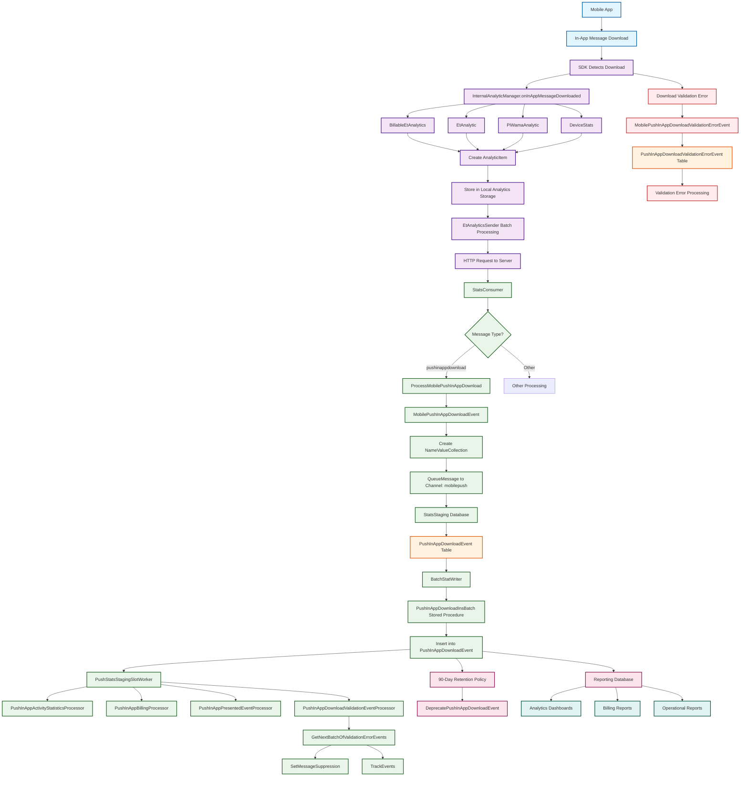

# In-App Message (IAM) Download Analytics Flow - End-to-End Diagram

## Flow Description

### **Phase 1: Mobile App & SDK (Blue/Purple)**
1. **Mobile App**: User's mobile application
2. **In-App Message Download**: IAM content is downloaded to device
3. **SDK Detects Download**: Android SDK detects the download event
4. **Analytics Manager**: `InternalAnalyticManager` processes the event
5. **Multiple Listeners**: Billable, ET, PI, and Device stats listeners
6. **Analytics Item**: Creates `AnalyticItem` with event data
7. **Local Storage**: Stores analytics data locally
8. **Batch Processing**: `EtAnalyticsSender` batches and sends data
9. **HTTP Request**: Sends analytics to server

### **Phase 2: Server Reception (Green)**
10. **StatsConsumer**: Receives analytics messages
11. **Message Processing**: Routes "pushinappdownload" messages
12. **Event Creation**: `MobilePushInAppDownloadEvent` creates event
13. **Data Collection**: Creates `NameValueCollection` with metadata
14. **Queue Message**: Queues for processing with 'mobilepush' channel

### **Phase 3: Database Storage (Orange)**
15. **StatsStaging Database**: Primary analytics database
16. **PushInAppDownloadEvent Table**: Stores download events
17. **Batch Processing**: `BatchStatWriter` handles batching
18. **Stored Procedure**: `PushInAppDownloadInsBatch` inserts data
19. **Data Insertion**: Inserts into `PushInAppDownloadEvent` table

### **Phase 4: Post-Processing (Pink)**
20. **Slot Worker**: `PushStatsStagingSlotWorker` processes events
21. **Activity Statistics**: Processes activity data
22. **Billing**: Handles billing calculations
23. **Presented Events**: Processes display events
24. **Validation Errors**: Handles download validation errors

### **Phase 5: Error Handling (Red)**
25. **Validation Errors**: Download validation failures
26. **Error Events**: `MobilePushInAppDownloadValidationErrorEvent`
27. **Error Table**: `PushInAppDownloadValidationErrorEvent` table
28. **Error Processing**: Specialized error handling

### **Phase 6: Data Management (Light Pink)**
29. **Retention Policy**: 90-day data retention
30. **Deprecation**: Automatic data cleanup
31. **Reporting**: Data flows to reporting systems
32. **Analytics**: Dashboard and reporting data
33. **Billing**: Billing report generation
34. **Operations**: Operational reporting

## Key Data Points Tracked

| Field | Description | Source |
|-------|-------------|---------|
| `DeviceID` | Unique device identifier | Mobile SDK |
| `ApplicationID` | App identifier | Mobile SDK |
| `PushMessageID` | In-app message ID | Server |
| `ActivityInstanceID` | Journey activity instance | Server |
| `EventDateUTC` | Download timestamp | Mobile SDK |
| `RequestID` | Request tracking ID | Mobile SDK |
| `UUID` | Unique event identifier | Mobile SDK |
| `MID/EID` | Member/Enterprise ID | Server |
| `CreatedBy` | User who triggered event | Server |

## Error Handling

- **Download Validation Errors**: Tracked separately in `PushInAppDownloadValidationErrorEvent`
- **Network Failures**: Retry mechanisms in `EtAnalyticsSender`
- **Database Failures**: Batch processing with rollback capabilities
- **Data Retention**: Automatic cleanup after 90 days

## Performance Considerations

- **Batch Processing**: Analytics are batched for efficiency
- **Asynchronous Processing**: Non-blocking event processing
- **Database Optimization**: Indexed tables for fast queries
- **Retention Policies**: Automatic data cleanup to manage storage
