# In-App Message (IAM) Download Analytics Flow - Server-Side Processing

```mermaid
graph TD
    %% Server Reception
    A[SDK sends analytics to ET_ANALYTICS endpoint] --> B[AnalyticEventServiceImpl.RecordAnalyticEvents]
    B --> C[Create DeviceAnalyticEvent wrapper]
    C --> D[Get queue configuration settings]
    D --> E[Enqueue to AutoFlushQueue]
    E --> F[Return response to SDK]
    
    %% Queue Processing
    F --> G[AutoFlushQueue timer/limit triggers]
    G --> H[Flush method called]
    H --> I[PushDevice.ProcessAnalyticEvents]
    I --> J[DeviceAnalyticEventExtensions.ToPushStatEvents]
    
    %% Event Processing
    J --> K[Parse analytics events]
    K --> L[Check UUID feature flag]
    L --> M[Process each event]
    M --> N[Decode object IDs]
    N --> O{Analytics type 14?}
    
    %% In-App Download Processing
    O -->|Yes - InboxDownload| P[Create PushStatEventInboxDownload]
    O -->|No - Other types| Q[Process other event types]
    P --> R{UUID exists?}
    R -->|Yes| S[Use existing UUID]
    R -->|No| T[Generate new UUID]
    T --> U[Compute event hash]
    S --> V[Add to statEvents list]
    U --> V
    Q --> V
    
    %% Queue Event Creation
    V --> W[PushStatEventInboxDownload.SendToQueue]
    W --> X[Create MobilePushInboxDownloadEvent]
    X --> Y[Record event with parameters]
    Y --> Z[Create NameValueCollection]
    Z --> AA[Add all event data]
    AA --> BB[Queue message with type 'pushinboxdownload']
    
    %% StatsConsumer Processing
    BB --> CC[StatsConsumer.DispatchMessage]
    CC --> DD{Message type?}
    DD -->|pushinboxdownload| EE[Create StatsInfo]
    DD -->|Other types| FF[Process other message types]
    EE --> GG[Get BatchPushInboxDownloadStatWriter]
    GG --> HH[ProcessStats.ProcessMobilePushInboxDownload]
    HH --> II[writer.AddFact]
    FF --> II
    
    %% Database Storage
    II --> JJ[BatchPushInboxDownloadStatWriter]
    JJ --> KK[Add to batch collection]
    KK --> LL{Batch size reached?}
    LL -->|Yes| MM[Execute stored procedure]
    LL -->|No| NN[Wait for more events]
    MM --> OO[dbo.PushInboxDownloadStatisticsInsBulkV2 or dbo.PushInboxDownloadStatisticsINSBulk]
    OO --> PP[Insert into staging database]
    NN --> KK
    
    %% Styling
    classDef serverPhase fill:#e1f5fe,stroke:#01579b,stroke-width:2px
    classDef queuePhase fill:#f3e5f5,stroke:#4a148c,stroke-width:2px
    classDef processingPhase fill:#e8f5e8,stroke:#1b5e20,stroke-width:2px
    classDef databasePhase fill:#fff3e0,stroke:#e65100,stroke-width:2px
    
    class A,B,C,D,E,F serverPhase
    class G,H,I,J queuePhase
    class K,L,M,N,O,P,Q,R,S,T,U,V,W,X,Y,Z,AA,BB processingPhase
    class CC,DD,EE,FF,GG,HH,II,JJ,KK,LL,MM,NN,OO,PP databasePhase
```

## Key Components in the Flow

### **1. Server Reception Phase**
- **AnalyticEventServiceImpl.RecordAnalyticEvents()**: Receives analytics data from SDK
- **DeviceAnalyticEvent**: Wraps the incoming analytics events
- **AutoFlushQueue**: Queues events for batch processing

### **2. Queue Processing Phase**
- **Flush()**: Processes queued events when timer/limit triggers
- **PushDevice.ProcessAnalyticEvents()**: Main processing method
- **DeviceAnalyticEventExtensions.ToPushStatEvents()**: Converts analytics to push stat events

### **3. Event Processing Phase**
- **Analytics Type Detection**: Identifies type 14 (InboxDownload) events
- **UUID Handling**: Manages deduplication with UUIDs or event hashes
- **PushStatEventInboxDownload**: Creates the specific event object
- **MobilePushInboxDownloadEvent**: Creates queue message

### **4. Database Storage Phase**
- **StatsConsumer**: Processes queue messages
- **ProcessStats.ProcessMobilePushInboxDownload()**: Final processing
- **BatchPushInboxDownloadStatWriter**: Handles batch writing
- **Stored Procedures**: Insert data into staging database

## Data Flow Summary

1. **SDK → Server**: Analytics data sent to ET_ANALYTICS endpoint
2. **Queue**: Events queued for batch processing
3. **Conversion**: Analytics events converted to push stat events
4. **Queue Message**: Event queued with type "pushinboxdownload"
5. **Processing**: StatsConsumer processes the queue message
6. **Batch Writing**: Data written to staging database in batches
7. **Storage**: Final storage in staging tables via stored procedures

This flow ensures efficient processing of in-app message download analytics from mobile devices to the staging database for further analysis and reporting.
