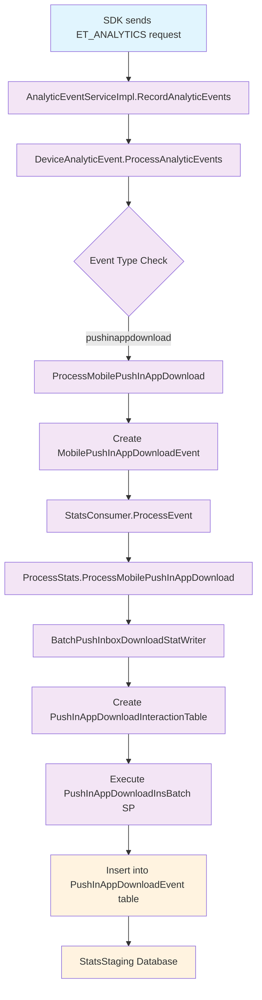

# In-App Message (IAM) Download Analytics - Server-Side Flow Diagram

## Flow Description

### 1. **SDK Request Reception**
- SDK sends analytics data via `MCRequests.ET_ANALYTICS` endpoint
- `AnalyticEventServiceImpl.RecordAnalyticEvents()` receives the request

### 2. **Event Processing**
- `DeviceAnalyticEvent.ProcessAnalyticEvents()` processes the incoming events
- Event type is checked for `pushinappdownload`
- `ProcessMobilePushInAppDownload()` handles the specific event type

### 3. **Event Object Creation**
- `MobilePushInAppDownloadEvent` object is created with event data
- Event is passed to `StatsConsumer.ProcessEvent()`

### 4. **Stats Processing**
- `ProcessStats.ProcessMobilePushInAppDownload()` processes the event
- `BatchPushInboxDownloadStatWriter` handles batching for database insertion

### 5. **Database Insertion**
- `PushInAppDownloadInteractionTable` type is created with event data
- `PushInAppDownloadInsBatch` stored procedure is executed
- Data is inserted into `PushInAppDownloadEvent` table in StatsStaging database

### 6. **Final Storage**
- Event data is successfully stored in the staging table
- Ready for further processing and aggregation
