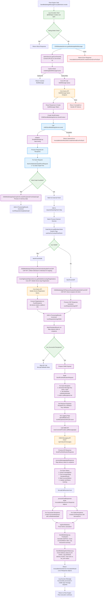

```mermaid
graph TD
    A[Flow Engine Calls<br/>SendMobileAppMessageInvocableAction.invoke] --> B[Log Invocation Start<br/>@WithSpan creates root span]
    
    B --> C{Debug Mode Check}
    C -->|Yes| D[Return Mock Response]
    C -->|No| E[CMSMetadataService.getMobileAppBulkMessage]
    
    E --> F[AdminService.getCoreTenantId<br/>Convert off-core to core tenant ID]
    F --> G[Cache Check: mobileAppBulkMessageCache]
    G -->|Cache Hit| H[Return Cached BulkMessage]
    G -->|Cache Miss| I[Core API Call: BulkMessage Query]
    
    I --> J[Core Query API<br/>BulkMessage Query Endpoint]
    
    J --> K[Parse Response & Create BulkMessage Object]
    K --> L[Create SendContext<br/>E360SendMobileAppService.SendContext]
    
    L --> M[Call e360SendMobileAppService.send]
    
    M --> N[Initialize SendMobileAppLog<br/>Start timing]
    
    N --> O[Process Requests for Recipients]
    
    O --> P[For Each Request:<br/>1. fetchUnifiedIndividualIdFromRequest<br/>2. Try Data Graph First]
    
    P --> Q{Data Graph Available?}
    Q -->|Yes| R[E360MobileAppDataGraphUtil.createRecipientsFromDataGraph<br/>Process in-memory data]
    Q -->|No| S[Mark for External Fetch]
    
    R --> T[Add to ProcessingResults<br/>Increment numRequestsUsingDataGraph]
    S --> U[Add to requestsNeedingFetch Map]
    
    U --> V[Batch Process External Sources]
    V --> W[GaterService.getBooleanValue<br/>Feature Flag: useHsoForContactPointFetch]
    
    W --> X{Use HSDB?}
    X -->|Yes| Y[fetchFromHSDB]
    X -->|No| Z[fetchFromCDP]
    
    Y --> AA[E360MobileAppCDPQueryUtil.fetchIndividualIdsFromCDP<br/>CDP API: Unified Individual to Individual ID mapping]
    AA --> BB[CoreHighScaleObjectsService.getMobileDeviceAppRegistrations<br/>Core API: Mobile Device App Registration]
    
    BB --> CC[Core Query API<br/>Mobile Device Registration Query]
    
    Z --> DD[E360MobileAppCDPQueryUtil.parseRecipientInfoFromCDP<br/>CDP API: Direct recipient info fetch]
    
    CC --> EE[Convert Registrations to PushRecipients<br/>Set device tokens, platform info]
    DD --> FF[Process CDP Response<br/>Increment numRequestsUsingCDP]
    
    EE --> GG[Add to ProcessingResults<br/>Increment numRequestsUsingHSDB]
    FF --> GG
    
    GG --> HH[Build RecipientResult List<br/>Map request index to recipients]
    
    HH --> II{Any Successful Recipients?}
    II -->|No| JJ[Skip API Call<br/>Set apiCallMade=false]
    II -->|Yes| KK[Prepare OMM Payload]
    
    KK --> LL[Build SendPushNotificationRequest]
    LL --> MM[For Each Recipient:<br/>1. Generate Message Key SHA-1 hash<br/>2. Set Attributes unifiedIndividualId<br/>3. Add to allRecipients list]
    
    MM --> NN[Set Request Properties<br/>Recipients list, Definition Key, Attributes]
    
    NN --> OO[Set Logging Flags<br/>apiCallMade=true, numRecipientsInAPICall=count]
    
    OO --> PP[Call OMM API<br/>nearCoreAuthProvider.callMessagingApi]
    
    PP --> QQ[E360 Messaging API<br/>POST /api/v2/push/messages]
    
    QQ --> RR[Process API Response<br/>SendPushNotificationResponse]
    
    RR --> SS[processMessagingApiResponse<br/>Map delivery status to recipients]
    
    SS --> TT[For Each Status:<br/>1. Extract messageKey<br/>2. Find corresponding RecipientResult<br/>3. Mark success/failure<br/>4. Update sentStatus tracking]
    
    TT --> UU[Set apiCallSuccess=true]
    
    UU --> VV[processFinalResponses<br/>Build InvocableActionService.Response objects]
    
    VV --> WW[For Successful Recipients:<br/>Create SuccessResponse with unifiedIndividualId]
    VV --> XX[For Failed Recipients:<br/>Create ErrorResponse with ServiceError]
    
    WW --> YY[logSendStatistics<br/>Final metrics calculation]
    XX --> YY
    
    YY --> ZZ[SendMobileAppLog Finalization<br/>Calculate totalTime, Count success/failure rates, Log structured summary]
    
    ZZ --> AAA[SendMobileAppSentStatusLog<br/>Chunk delivery status by 25 entries, Log individual delivery results, Track sent vs not_sent status]
    
    AAA --> BBB[Return InvocableActionService.InvocationResult<br/>List of Response objects]
    
    BBB --> CCC[Log Success Message<br/>Successfully processed X mobile app message requests]
    
    CCC --> DDD[Return to Flow Engine<br/>Flow execution continues]
    
    %% Error Handling Paths
    E -->|Error| EEE[Return Error Response<br/>InvocableActionResultUtil.createGenericErrorForEach]
    J -->|Error| FFF[Return CoreApiError<br/>Handle API failures]
    M -->|Exception| GGG[Return Internal Error<br/>InvocableActionResultUtil.createInternalErrorForEach]
    
    %% Styling
    classDef apiCall fill:#fff3e0,stroke:#ff9800,stroke-width:2px
    classDef methodCall fill:#e3f2fd,stroke:#2196f3,stroke-width:2px
    classDef serviceClass fill:#f3e5f5,stroke:#9c27b0,stroke-width:2px
    classDef flowControl fill:#e8f5e8,stroke:#4caf50,stroke-width:2px
    classDef errorHandling fill:#ffebee,stroke:#f44336,stroke-width:2px
    
    class J,CC,QQ apiCall
    class E,M,O,P,AA,BB,DD,LL,MM,NN,OO,PP,SS,TT,VV,WW,XX,YY,ZZ,AAA methodCall
    class F,G,I,K,L,N,R,AA,BB,DD,EE,FF,GG,HH,KK,LL,MM,NN,OO,PP,RR,SS,TT,VV,WW,XX,YY,ZZ,AAA serviceClass
    class B,C,Q,X,II flowControl
    class EEE,FFF,GGG errorHandling
```
